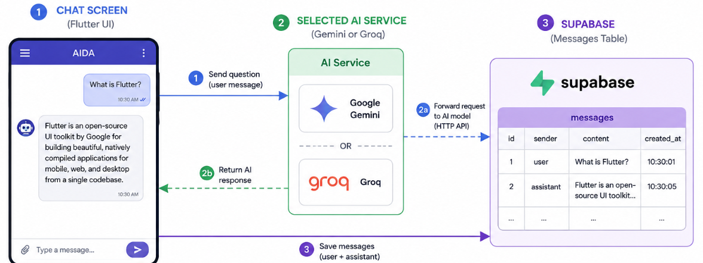
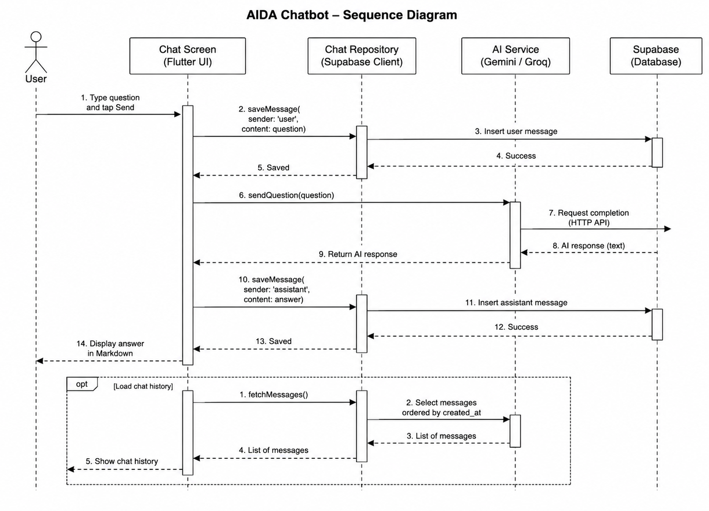

# Case 01 — Build AIDA, a Flutter AI Chatbot

## A hands-on beginner workshop using Flutter, Supabase, Gemini, and Groq

This case study is for complete beginners. You do not need previous programming,
database, or artificial intelligence experience. You will learn by typing small
pieces of code, running the app, and observing what changes.

> **Goal:** Build an Android chatbot named **AIDA** that accepts a question,
> sends it to Gemini or Groq, displays the Markdown-formatted answer, and saves
> the conversation messages in Supabase.

## Learning outcomes

By the end of this case, you will be able to:

1. Install and check Flutter and Android Studio.
2. Create and understand the main folders in a Flutter project.
3. Create a Supabase table and connect it to Flutter.
4. Keep local configuration in a Git-ignored `.env` file.
5. Build a simple mobile chat interface with Flutter widgets.
6. Request an AI response from either Gemini or Groq.
7. Render AI responses as readable Markdown.
8. Write and run one widget test and one logic test.
9. Run the app on an emulator and a physical Android phone.
10. Build an installable Android APK.

## What you are building

The app has four main parts:



**Purpose:** This map shows how the screen, AI provider, and database work
together. The screen coordinates the work while each service has one clear job.



## Before you begin

Prepare the following:

- A Windows, macOS, or Linux computer with internet access.
- At least 16 GB RAM if you plan to use the Android Emulator.
- A Google account for Gemini and a Groq account if you want to try both providers.
- A free Supabase account.
- An Android phone and USB cable for the physical-device exercise.
- About 5–7 hours for a first guided attempt. Installation and downloads may
  take longer on slower computers or internet connections.

---

# Step 1 — Install Flutter SDK and Android Studio

> **Estimated time:** 45–60 minutes

## 1.1 Install Flutter

1. Open the official [Flutter installation guide](https://docs.flutter.dev/install/manual).
2. Select your operating system.
3. Download and extract the Flutter SDK to a simple location. On Windows, an
   example is `C:\src\flutter`; avoid protected folders such as `Program Files`.
4. Add Flutter's `bin` folder to your system `PATH` by following the official guide.
5. Close and reopen your terminal.

**Purpose:** This command checks whether your computer can find the Flutter SDK
and reports any Android tools that are still missing.

```powershell
flutter doctor
```

Do not worry if the first report contains warnings. Read each line and complete
the suggested action, then run `flutter doctor` again.

## 1.2 Install Android Studio

1. Download [Android Studio](https://developer.android.com/studio/install).
2. Run its Setup Wizard.
3. Allow it to install the Android SDK, Android SDK Platform-Tools, and Emulator.
4. Open **Settings > Plugins**, install the **Flutter** plugin, and accept the
   suggested Dart plugin installation.
5. Open **More Actions > SDK Manager** and confirm that a recent Android SDK is installed.

**Purpose:** Android licenses must be accepted before Flutter can build Android
applications. Type `y` when the terminal asks whether you accept a license.

```powershell
flutter doctor --android-licenses
```

**Checkpoint:** Run `flutter doctor`. Flutter and the Android toolchain should
have green check marks.

### Reflection

What installation problem did you encounter, and what action helped you solve
or better understand it? Share one moment when a warning changed into a green
check mark.

### Completed code reference

- [AIDA repository and prerequisites](https://github.com/cbatuic/aida#prerequisites)
- [Completed Case 01 guide](https://github.com/cbatuic/aida/blob/main/Case-01.md)

---

# Step 2 — Create a Flutter project

> **Estimated time:** 20–30 minutes

## 2.1 Generate the starter project

Open a terminal in the folder where you keep projects.

**Purpose:** These commands generate a new Flutter application named `aida` and
move the terminal into its project folder.

```powershell
flutter create aida
cd aida
```

Open the folder in Android Studio with **File > Open**, then select the `aida` folder.

## 2.2 Install the packages

**Purpose:** These packages provide Supabase access, HTTP requests, `.env`
loading, and Markdown rendering. Flutter records them in `pubspec.yaml`.

```powershell
flutter pub add supabase_flutter http flutter_dotenv flutter_markdown_plus
```

Confirm that `pubspec.yaml` contains the packages. Version numbers may be newer
than these examples when you complete the workshop.

**Purpose:** The dependency section tells Flutter which reusable libraries the
app needs. The asset section makes the local `.env` file available at runtime.

```yaml
dependencies:
  flutter:
    sdk: flutter
  supabase_flutter: ^2.16.0
  http: ^1.6.0
  flutter_dotenv: ^6.0.1
  flutter_markdown_plus: ^1.0.12

flutter:
  uses-material-design: true
  assets:
    - .env
```

## 2.3 Create the folders

Inside `lib`, create `models`, `screens`, and `services` folders. Your important
project files will eventually look like this:

**Purpose:** This structure separates data, screens, and external services so a
beginner can find each responsibility without searching one large file.

```text
lib/
├── main.dart
├── models/
│   └── chat_message.dart
├── screens/
│   └── chat_page.dart
└── services/
    ├── ai_service.dart
    ├── chat_repository.dart
    ├── gemini_service.dart
    └── groq_service.dart
```

## 2.4 Allow Android internet access

Open `android/app/src/main/AndroidManifest.xml` and place the permission directly
inside the `<manifest>` element, above `<application>`.

**Purpose:** Android blocks network access unless the application declares this
permission. AIDA needs the internet to contact Supabase and the AI APIs.

```xml
<uses-permission android:name="android.permission.INTERNET"/>
```

### Reflection

Which project folder or file made the most sense to you, and which one is still
unclear? Explain in your own words what you think `lib` and `pubspec.yaml` do.

### Completed code reference

- [Flutter dependencies and assets (`pubspec.yaml`)](https://github.com/cbatuic/aida/blob/main/pubspec.yaml)
- [Completed `lib` folder](https://github.com/cbatuic/aida/tree/main/lib)
- [Android internet permission](https://github.com/cbatuic/aida/blob/main/android/app/src/main/AndroidManifest.xml)

---

# Step 3 — Create a Supabase project and connect it

> **Estimated time:** 30–45 minutes

## 3.1 Create the cloud database

1. Open the [Supabase Dashboard](https://database.new).
2. Select **New project**.
3. Enter a project name such as `aida-learning`.
4. Create and safely store the database password.
5. Select a nearby region and wait for the project to finish provisioning.

## 3.2 Create the messages table

Open **SQL Editor > New query**, paste the following SQL, and select **Run**.

**Purpose:** This SQL creates a table for user and assistant messages. Row Level
Security allows only limited inserts for this classroom demonstration.

```sql
create table public.messages (
  id uuid primary key default gen_random_uuid(),
  sender text not null check (sender in ('user', 'assistant')),
  content text not null check (char_length(content) between 1 and 10000),
  created_at timestamptz not null default now()
);

alter table public.messages enable row level security;

grant insert on table public.messages to anon, authenticated;

create policy "tutorial users can insert messages"
on public.messages
for insert
to anon, authenticated
with check (
  sender in ('user', 'assistant')
  and char_length(content) between 1 and 10000
);
```

> **Learning note:** This insert-only anonymous policy is acceptable for a
> classroom prototype, not a public production app. A real application should
> authenticate users, associate each row with its owner, add rate limiting, and
> restrict who can read or write each message.

## 3.3 Copy the connection values

Open the project's **Connect** panel and find:

- Project URL
- Publishable key

Do not use the `service_role` key in a mobile application. It has powerful
server permissions and must remain on a trusted backend.

## 3.4 Create the repository

Create `lib/services/chat_repository.dart`.

**Purpose:** The repository gives the rest of the app one simple `saveMessage`
operation. It keeps Supabase-specific code out of the chat screen.

```dart
import 'package:supabase_flutter/supabase_flutter.dart';

abstract interface class MessageRepository {
  Future<void> saveMessage({
    required String sender,
    required String content,
  });
}

class ChatRepository implements MessageRepository {
  ChatRepository(this._client);

  final SupabaseClient _client;

  @override
  Future<void> saveMessage({
    required String sender,
    required String content,
  }) async {
    final cleanSender = sender.trim();
    final cleanContent = content.trim();
    if (cleanSender.isEmpty || cleanContent.isEmpty) return;

    await _client.from('messages').insert({
      'sender': cleanSender,
      'content': cleanContent,
    });
  }
}
```

The completed project uses this same repository in
[`lib/services/chat_repository.dart`](lib/services/chat_repository.dart).

### Reflection

After viewing a saved message in the Supabase Table Editor, how did your idea of
a “database” change? Describe the connection between one chat bubble and one
database row.

### Completed code reference

- [Supabase message repository](https://github.com/cbatuic/aida/blob/main/lib/services/chat_repository.dart)
- [Supabase initialization in `main.dart`](https://github.com/cbatuic/aida/blob/main/lib/main.dart)

---

# Step 4 — Add Gemini and Groq API keys

> **Estimated time:** 20–30 minutes

## 4.1 Create the API keys

### Gemini

1. Open [Google AI Studio API keys](https://ai.google.dev/gemini-api/docs/api-key).
2. Accept the terms if prompted.
3. Create or select a Google Cloud project.
4. Create a Gemini API key and copy it once.

### Groq

1. Open the [Groq Console quickstart](https://console.groq.com/docs/quickstart).
2. Sign in and create a project if required.
3. Open **API Keys**, create a key, and copy it once.

## 4.2 Create `.env`

Create a file named `.env` in the project root, beside `pubspec.yaml`.

**Purpose:** This file keeps configuration out of Dart source files and lets you
select Gemini or Groq with one flag. Replace every placeholder with your value.

```dotenv
AI_PROVIDER=gemini
SUPABASE_URL=https://your-project.supabase.co
SUPABASE_KEY=your_supabase_publishable_key
GEMINI_API_KEY=your_gemini_api_key
GROQ_API_KEY=your_groq_api_key
```

Use `AI_PROVIDER=gemini` for Gemini or `AI_PROVIDER=groq` for Groq. Only the key
for the selected AI provider is required while that provider is active.

## 4.3 Protect `.env` from Git

Add these lines to `.gitignore`.

**Purpose:** Git will ignore local environment files that may contain keys, but
it can still commit `.env.example` because that file contains placeholders only.

```gitignore
.env
.env.*
!.env.example
```

Create `.env.example` for other learners.

**Purpose:** The example documents every required variable without sharing real
credentials. A new learner copies it to `.env` and fills in private values.

```dotenv
AI_PROVIDER=gemini
SUPABASE_URL=https://your-project.supabase.co
SUPABASE_KEY=your_supabase_publishable_key
GEMINI_API_KEY=your_gemini_api_key
GROQ_API_KEY=your_groq_api_key
```

> **Security warning:** Git-ignoring `.env` prevents accidental commits, but it
> does not make mobile API keys secret. Flutter assets are included in the APK
> and can be extracted. For production, send AI requests through your own secure
> backend or Supabase Edge Function and keep provider keys there.

### Reflection

Why should an API key never be pasted directly into a public repository? Share
how the `.env`, `.env.example`, and `.gitignore` files have different purposes.

### Completed code reference

- [Safe environment template (`.env.example`)](https://github.com/cbatuic/aida/blob/main/.env.example)
- [Environment ignore rules (`.gitignore`)](https://github.com/cbatuic/aida/blob/main/.gitignore)
- [Environment loading and validation](https://github.com/cbatuic/aida/blob/main/lib/main.dart)

---

# Step 5 — Build a simple chatbot interface

> **Estimated time:** 45–60 minutes

## 5.1 Create the message model

Create `lib/models/chat_message.dart`.

**Purpose:** A `ChatMessage` stores the visible text and remembers whether the
message came from the user. The screen uses that value to choose its alignment.

```dart
class ChatMessage {
  const ChatMessage({
    required this.text,
    required this.isUser,
  });

  final String text;
  final bool isUser;
}
```

## 5.2 Understand a Flutter widget

A widget is a building block on the screen. `Text`, `IconButton`, `Row`, and
`Column` are widgets; larger widgets are assembled from smaller ones.

The finished chat page is available at
[`lib/screens/chat_page.dart`](lib/screens/chat_page.dart). Live-code it in four
small sections instead of typing the entire file at once.

### Section A — Page state

**Purpose:** This state stores the typed text, visible messages, scrolling
controller, and loading flag. Changing state tells Flutter to redraw the screen.

```dart
final _controller = TextEditingController();
final _scrollController = ScrollController();

final List<ChatMessage> _messages = const [
  ChatMessage(
    text: 'Hello! I am AIDA. What would you like to learn today?',
    isUser: false,
  ),
].toList();

bool _isLoading = false;
```

### Section B — Send a message

**Purpose:** This method adds the user's message, requests an AI reply, and adds
the reply to the screen. Saving history runs separately so a database problem
does not prevent the AI answer from appearing.

```dart
Future<void> _sendMessage() async {
  final text = _controller.text.trim();
  if (text.isEmpty || _isLoading) return;

  setState(() {
    _messages.add(ChatMessage(text: text, isUser: true));
    _controller.clear();
    _isLoading = true;
  });

  unawaited(_saveMessage(sender: 'user', content: text));

  try {
    final reply = await widget.aiService.generateReply(text);
    if (!mounted) return;

    setState(() {
      _messages.add(ChatMessage(text: reply, isUser: false));
    });
    unawaited(_saveMessage(sender: 'assistant', content: reply));
  } on AiServiceException catch (error) {
    if (!mounted) return;
    setState(() {
      _messages.add(ChatMessage(text: error.userMessage, isUser: false));
    });
  } finally {
    if (mounted) setState(() => _isLoading = false);
  }
}
```

### Section C — Main page layout

**Purpose:** A `Column` places the message list above the input row. `Expanded`
gives the scrolling list the available space without covering the composer.

```dart
Scaffold(
  appBar: AppBar(title: const Text('AIDA'), centerTitle: true),
  body: SafeArea(
    child: Column(
      children: [
        Expanded(
          child: ListView.builder(
            controller: _scrollController,
            padding: const EdgeInsets.all(16),
            itemCount: _messages.length,
            itemBuilder: (context, index) {
              return MessageBubble(message: _messages[index]);
            },
          ),
        ),
        if (_isLoading) const LinearProgressIndicator(),
        _MessageComposer(
          controller: _controller,
          isLoading: _isLoading,
          onSend: _sendMessage,
        ),
      ],
    ),
  ),
)
```

### Section D — Input controls

**Purpose:** The text field collects a question and the button calls `_sendMessage`.
Both controls are disabled while AIDA is waiting for an answer.

```dart
Row(
  children: [
    Expanded(
      child: TextField(
        key: const Key('messageField'),
        controller: controller,
        enabled: !isLoading,
        minLines: 1,
        maxLines: 4,
        decoration: const InputDecoration(
          hintText: 'Type a message...',
          border: OutlineInputBorder(),
        ),
      ),
    ),
    IconButton.filled(
      key: const Key('sendButton'),
      onPressed: isLoading ? null : onSend,
      icon: const Icon(Icons.send),
    ),
  ],
)
```

## 5.3 Render Markdown answers

Inside the assistant bubble, use `MarkdownBody` instead of plain `Text`.

**Purpose:** Markdown turns markers such as `**bold**`, lists, and code fences
into formatted content. User messages remain plain text exactly as entered.

```dart
child: message.isUser
    ? Text(message.text)
    : MarkdownBody(
        data: message.text,
        selectable: true,
        softLineBreak: true,
      ),
```

**Checkpoint:** The interface should now show a welcome bubble, an input field,
and a send button. The AI connection comes next.

### Reflection

Which Flutter widget had the most visible effect on your screen? Describe one
change you made and what you observed after running or reloading the app.

### Completed code reference

- [Chat message model](https://github.com/cbatuic/aida/blob/main/lib/models/chat_message.dart)
- [Completed chat interface and Markdown bubbles](https://github.com/cbatuic/aida/blob/main/lib/screens/chat_page.dart)

---

# Step 6 — Generate AI responses with Gemini and Groq

> **Estimated time:** 50–70 minutes

## 6.1 Create a shared AI contract

Create `lib/services/ai_service.dart`.

**Purpose:** Both providers promise to implement the same `generateReply`
operation. The screen can therefore use either provider without changing its UI.

```dart
enum AiProvider {
  gemini,
  groq;

  static AiProvider? tryParse(String value) {
    final normalized = value.trim().toLowerCase();
    for (final provider in values) {
      if (provider.name == normalized) return provider;
    }
    return null;
  }
}

abstract interface class AiService {
  Future<String> generateReply(String userMessage);
  void close();
}

class AiServiceException implements Exception {
  const AiServiceException(this.userMessage);
  final String userMessage;
}
```

## 6.2 Connect Gemini

The complete hardened implementation is in
[`lib/services/gemini_service.dart`](lib/services/gemini_service.dart). The
following is the central request that beginners should understand first.

**Purpose:** This request sends the user's message and tutor instructions to
Gemini. The API key authenticates the request, while the token and thinking
settings keep the answer complete and suitable for simple chat.

```dart
final uri = Uri.parse(
  'https://generativelanguage.googleapis.com/v1beta/'
  'models/gemini-3.6-flash:generateContent',
);

final response = await http.post(
  uri,
  headers: {
    'Content-Type': 'application/json',
    'x-goog-api-key': apiKey,
  },
  body: jsonEncode({
    'system_instruction': {
      'parts': [
        {
          'text': 'You are AIDA, a friendly beginner tutor. '
              'Answer directly using plain language and practical examples.'
        }
      ]
    },
    'contents': [
      {
        'role': 'user',
        'parts': [
          {'text': userMessage}
        ]
      }
    ],
    'generationConfig': {
      'maxOutputTokens': 2048,
      'thinkingConfig': {'thinkingLevel': 'minimal'},
    },
  }),
);
```

The full service also adds a timeout, friendly errors, safe JSON decoding, and
proper HTTP client cleanup. These protections explain why its final file is
longer than the central request above.

## 6.3 Connect Groq

The complete implementation is in
[`lib/services/groq_service.dart`](lib/services/groq_service.dart).

**Purpose:** Groq uses an OpenAI-compatible chat endpoint and bearer token. The
request selects `llama-3.1-8b-instant` and sends system and user messages.

```dart
final uri = Uri.parse(
  'https://api.groq.com/openai/v1/chat/completions',
);

final response = await http.post(
  uri,
  headers: {
    'Content-Type': 'application/json',
    'Authorization': 'Bearer $apiKey',
  },
  body: jsonEncode({
    'model': 'llama-3.1-8b-instant',
    'messages': [
      {
        'role': 'system',
        'content': 'You are AIDA, a friendly beginner tutor. '
            'Answer directly using plain language and practical examples.',
      },
      {'role': 'user', 'content': userMessage},
    ],
    'temperature': 0.7,
    'max_completion_tokens': 2048,
  }),
);
```

> **Model lifecycle note (August 2026):** Groq has announced an August 16, 2026
> shutdown for `llama-3.1-8b-instant` on free and developer tiers. This case
> keeps the requested classroom model, but future learners should check
> [Groq model deprecations](https://console.groq.com/docs/deprecations) and use
> the recommended replacement when necessary.

## 6.4 Load configuration and select a provider

The complete startup code is in [`lib/main.dart`](lib/main.dart).

**Purpose:** Startup loads `.env`, validates the selected provider, initializes
Supabase, and creates only the AI service selected by `AI_PROVIDER`.

```dart
Future<void> main() async {
  WidgetsFlutterBinding.ensureInitialized();
  await dotenv.load(fileName: '.env');

  final supabaseUrl = dotenv.get('SUPABASE_URL').trim();
  final supabaseKey = dotenv.get('SUPABASE_KEY').trim();
  final geminiApiKey = dotenv.maybeGet('GEMINI_API_KEY')?.trim() ?? '';
  final groqApiKey = dotenv.maybeGet('GROQ_API_KEY')?.trim() ?? '';
  final provider = AiProvider.tryParse(dotenv.get('AI_PROVIDER'));

  if (provider == null) {
    throw StateError('AI_PROVIDER must be gemini or groq.');
  }

  await Supabase.initialize(
    url: supabaseUrl,
    publishableKey: supabaseKey,
  );

  final aiService = switch (provider) {
    AiProvider.gemini => GeminiService(apiKey: geminiApiKey),
    AiProvider.groq => GroqService(apiKey: groqApiKey),
  };

  runApp(
    AidaApp(
      aiService: aiService,
      chatRepository: ChatRepository(Supabase.instance.client),
    ),
  );
}
```

**Checkpoint:** Set `AI_PROVIDER=gemini`, run the app, and ask “Explain Flutter
using a cooking analogy.” Then stop the app, change the flag to `groq`, restart,
and ask the same question.

### Reflection

Compare the answers from Gemini and Groq. What differences did you notice in
speed, detail, tone, or formatting, and which response was more useful to you?

### Completed code reference

- [Shared AI provider contract](https://github.com/cbatuic/aida/blob/main/lib/services/ai_service.dart)
- [Gemini service integration](https://github.com/cbatuic/aida/blob/main/lib/services/gemini_service.dart)
- [Groq service integration](https://github.com/cbatuic/aida/blob/main/lib/services/groq_service.dart)
- [Provider selection at startup](https://github.com/cbatuic/aida/blob/main/lib/main.dart)

---

# Step 7 — Write one widget test and one logic test

> **Estimated time:** 25–35 minutes

Tests are small programs that check whether another part of the program behaves
as expected. They let you make changes with less fear of breaking old behavior.

## 7.1 Basic widget test

Create or replace `test/widget_test.dart`. The finished project contains more
widget tests; this workshop begins with one visible behavior.

**Purpose:** This test builds the app with fake services, types `Hello`, taps the
send button, and checks that both the question and fake reply appear.

```dart
import 'package:aida/main.dart';
import 'package:aida/services/ai_service.dart';
import 'package:aida/services/chat_repository.dart';
import 'package:flutter/material.dart';
import 'package:flutter_test/flutter_test.dart';

void main() {
  testWidgets('sends a message and displays a reply', (tester) async {
    await tester.pumpWidget(
      AidaApp(
        aiService: _FakeAiService(),
        chatRepository: _FakeRepository(),
      ),
    );

    await tester.enterText(
      find.byKey(const Key('messageField')),
      'Hello',
    );
    await tester.tap(find.byKey(const Key('sendButton')));
    await tester.pumpAndSettle();

    expect(find.text('Hello'), findsOneWidget);
    expect(find.text('Test reply'), findsOneWidget);
  });
}

class _FakeAiService implements AiService {
  @override
  Future<String> generateReply(String userMessage) async => 'Test reply';

  @override
  void close() {}
}

class _FakeRepository implements MessageRepository {
  @override
  Future<void> saveMessage({
    required String sender,
    required String content,
  }) async {}
}
```

## 7.2 Simple logic test

Create `test/ai_provider_test.dart`.

**Purpose:** This test checks that the text from `.env` selects the right provider
even when capitalization or spaces differ. It also rejects an unknown provider.

```dart
import 'package:aida/services/ai_service.dart';
import 'package:flutter_test/flutter_test.dart';

void main() {
  test('parses supported AI provider names', () {
    expect(AiProvider.tryParse(' GEMINI '), AiProvider.gemini);
    expect(AiProvider.tryParse('Groq'), AiProvider.groq);
    expect(AiProvider.tryParse('unknown'), isNull);
  });
}
```

## 7.3 Run the tests

**Purpose:** This command runs every test file inside the `test` folder. A green
result means the checked behaviors worked as expected.

```powershell
flutter test
```

Also run the analyzer before continuing.

**Purpose:** The analyzer finds common Dart mistakes, unused code, and style
problems without launching the application.

```powershell
flutter analyze
```

### Reflection

How did it feel to see a test pass or fail? Explain how a test could help you
change the app later without accidentally breaking a feature that already works.

### Completed code reference

- [Widget tests](https://github.com/cbatuic/aida/blob/main/test/widget_test.dart)
- [Gemini logic and request tests](https://github.com/cbatuic/aida/blob/main/test/gemini_service_test.dart)
- [Provider-selection and Groq tests](https://github.com/cbatuic/aida/blob/main/test/groq_service_test.dart)

---

# Step 8 — Run on an emulator and an Android phone

> **Estimated time:** 30–45 minutes

## 8.1 Run on an Android Emulator

1. Open Android Studio.
2. Select **View > Tool Windows > Device Manager**.
3. Select **Create Virtual Device**.
4. Choose a phone such as Pixel, then download a recommended Android image.
5. Finish the setup and press the play button beside the virtual device.

Check that Flutter can see it.

**Purpose:** This command lists emulators and physical phones currently available
to Flutter. The emulator should appear with a device identifier.

```powershell
flutter devices
```

Run AIDA.

**Purpose:** Flutter builds the debug app, installs it on the selected device,
and shows live logs in the terminal.

```powershell
flutter run
```

Try these checks:

- Send a short question and confirm a Markdown-formatted answer appears.
- Open Supabase **Table Editor > messages** and confirm new rows appear.
- Change `AI_PROVIDER`, stop the app, and run it again.
- Temporarily turn off the emulator network and observe the friendly error.

## 8.2 Run on a physical Android phone

1. On the phone, open **Settings > About phone**.
2. Tap **Build number** seven times to enable Developer options.
3. Open **Developer options** and enable **USB debugging**.
4. Connect the phone using a data-capable USB cable.
5. Accept the “Allow USB debugging” prompt on the phone.
6. On Windows, install the manufacturer's USB driver if the phone is not detected.

**Purpose:** This command confirms that Android Debug Bridge can communicate
with the phone. Its status should be `device`, not `unauthorized`.

```powershell
adb devices
```

Run Flutter and select the phone if more than one device is connected.

**Purpose:** The `-d` option tells Flutter exactly which connected Android device
should receive the app. Replace the example identifier with your device ID.

```powershell
flutter run -d YOUR_DEVICE_ID
```

Always test on a real phone before sharing an application. A phone can reveal
keyboard, network, performance, and screen-size behavior that differs from an emulator.

### Reflection

What difference did you notice between the emulator and the physical phone?
Share one issue or improvement that became visible only when using a real device.

### Completed code reference

- [Run and test instructions](https://github.com/cbatuic/aida#run-and-test)
- [Android application configuration](https://github.com/cbatuic/aida/tree/main/android/app)
- [Completed AIDA application source](https://github.com/cbatuic/aida/tree/main/lib)

---

# Step 9 — Build the APK

> **Estimated time:** 10–20 minutes

## 9.1 Build one APK for classroom sharing

**Purpose:** This command creates a release APK containing Android binaries for
multiple processor types. It is convenient for a small classroom demonstration.

```powershell
flutter build apk
```

The output is normally:

**Purpose:** This path tells you where Flutter places the finished installable
file. You can copy this APK to a test phone that allows local app installation.

```text
build/app/outputs/flutter-apk/app-release.apk
```

## 9.2 Build smaller APKs

**Purpose:** This command creates separate APKs for different processor types.
Each file is smaller because it contains only one device architecture.

```powershell
flutter build apk --split-per-abi
```

For Google Play distribution, Flutter recommends an Android App Bundle instead
of an APK. Release publishing also requires a unique application ID, versioning,
an upload keystore, privacy review, and Play Console preparation.

### Reflection

What did producing an APK mean to you compared with only seeing source code in
Android Studio? Describe how you would demonstrate the finished AIDA app to
someone who has never seen it.

### Completed code reference

- [APK build instructions](https://github.com/cbatuic/aida#build-the-apk)
- [Android Gradle build configuration](https://github.com/cbatuic/aida/blob/main/android/app/build.gradle.kts)
- [Complete AIDA repository](https://github.com/cbatuic/aida)

---

# Final verification checklist

Use this checklist before declaring the exercise complete:

- [ ] `flutter doctor` reports a working Flutter and Android toolchain.
- [ ] `.env` contains real local values and is ignored by Git.
- [ ] `.env.example` contains placeholders only.
- [ ] Supabase has a `messages` table with RLS enabled.
- [ ] Gemini works when `AI_PROVIDER=gemini`.
- [ ] Groq works when `AI_PROVIDER=groq` and the selected model remains available.
- [ ] Assistant Markdown is rendered instead of displaying `**` markers.
- [ ] `flutter analyze` reports no issues.
- [ ] `flutter test` passes.
- [ ] AIDA runs on an emulator and a physical Android phone.
- [ ] The APK appears in the expected build folder.

# Common beginner problems

## “Could not load .env”

Confirm the file is named exactly `.env`, is beside `pubspec.yaml`, and is listed
under `flutter > assets` in `pubspec.yaml`. Stop and rebuild after changing assets.

## “Missing configuration”

Check spelling and remove spaces around variable names. The required key depends
on `AI_PROVIDER`; Gemini needs `GEMINI_API_KEY`, while Groq needs `GROQ_API_KEY`.

## “Permission denied” from Supabase

Confirm that RLS is enabled and the insert policy was created. Also confirm that
the app uses the publishable key, not a server-only secret.

## The AI request times out or cannot connect

Open a webpage inside the emulator to confirm internet access. Restart the
emulator, disable restrictive VPN/proxy software temporarily, and verify the API
key in the provider dashboard.

## Markdown markers are visible

Confirm `flutter_markdown_plus` is installed and assistant messages use
`MarkdownBody(data: message.text)` instead of `Text(message.text)`.

## The phone is unauthorized

Unlock the phone, unplug and reconnect the cable, then accept the USB debugging
prompt. Run `adb devices` again.

# Suggested learner challenges

After the basic case works, try one change at a time:

1. Add a clear-chat button.
2. Load saved messages from Supabase when the app starts.
3. Add user authentication and per-user RLS policies.
4. Show which AI provider is active in the app bar.
5. Add a retry button to failed messages.
6. Move Gemini and Groq calls to a secure backend or Supabase Edge Function.
7. Add an integration test that runs on an emulator.

# Glossary

- **API:** A defined way for two programs to communicate.
- **API key:** A credential that identifies a project when calling an API.
- **APK:** An installable Android application package.
- **Database:** Organized storage for application data.
- **Emulator:** A virtual Android device running on a computer.
- **Flutter:** Google's toolkit for building applications from one Dart codebase.
- **Markdown:** Plain-text markers that represent formatting such as bold or lists.
- **RLS:** Row Level Security; database rules that control which rows a user may access.
- **Widget:** A Flutter building block for visible UI or layout behavior.

# Additional resources

## Flutter and Dart

- [Install Flutter](https://docs.flutter.dev/install/manual)
- [Flutter learning pathway](https://docs.flutter.dev/get-started/learn-flutter)
- [Flutter widget catalog](https://docs.flutter.dev/ui/widgets)
- [Dart language tour](https://dart.dev/language)
- [Testing Flutter applications](https://docs.flutter.dev/testing/overview)
- [Build and release an Android app](https://docs.flutter.dev/deployment/android)

## Android

- [Install Android Studio](https://developer.android.com/studio/install)
- [Create and manage virtual devices](https://developer.android.com/studio/run/managing-avds)
- [Run on the Android Emulator](https://developer.android.com/studio/run/emulator)
- [Run on a physical Android device](https://developer.android.com/studio/run/device)

## Supabase

- [Supabase Flutter quickstart](https://supabase.com/docs/guides/getting-started/quickstarts/flutter)
- [Install the Supabase Flutter client](https://supabase.com/docs/reference/dart/installing)
- [Row Level Security](https://supabase.com/docs/guides/database/postgres/row-level-security)
- [Supabase API key types](https://supabase.com/docs/guides/api/api-keys)

## Gemini and Groq

- [Gemini API keys](https://ai.google.dev/gemini-api/docs/api-key)
- [Gemini API troubleshooting](https://ai.google.dev/gemini-api/docs/troubleshooting)
- [Groq quickstart](https://console.groq.com/docs/quickstart)
- [Groq API reference](https://console.groq.com/docs/api-reference)
- [Groq model deprecations](https://console.groq.com/docs/deprecations)

---

You have completed Case 01 when AIDA can answer through both configured providers,
save messages to Supabase, pass its tests, and run on both a virtual and physical
Android device.

# Evidence submission and scoring

## Total points: 100 maximum

Choose **one** evidence option from the table below. Challenge points are added
to the selected evidence score, but the final Case 01 grade cannot exceed 100
points.

| Evidence option | Submission instructions | Maximum base points |
| --- | --- | ---: |
| **Evidence A** | Submit one recording of your entire progress, starting with installation and ending with the complete working AIDA demonstration. Include a clear voice-over that explains what you are doing, important code or settings, problems encountered, and how you verified the result. | **95 points** |
| **Evidence B** | Submit one recording of the completed working case demonstration. Include a clear voice-over that demonstrates the chat interface, Gemini and Groq provider switching, Supabase message records, tests, phone or emulator execution, and the built APK. | **85 points** |
| **Evidence C** | Submit one PDF containing ordered screenshots from the case. Add a short explanation below every screenshot stating the step shown, what you did, and what result proves that the step worked. | **80 points** |

## Submission checklist

1. Name the submission using the format `Case-01_YourName_Evidence-A`,
   `Case-01_YourName_Evidence-B`, or `Case-01_YourName_Evidence-C`.
2. Make sure text, terminal output, emulator screens, and phone screens are
   readable. Do not expose real API keys, passwords, or private `.env` values.
3. For video evidence, use a common format such as MP4, speak clearly, and show
   the important result of every required task included in your evidence option.
4. For PDF evidence, arrange screenshots in Steps 1–9 order and use short,
   beginner-friendly explanations rather than screenshots without context.
5. Before submitting, open the video or PDF yourself and confirm that it plays
   or displays correctly from beginning to end.

## Case challenge — earn up to 10 additional points

Improve AIDA by adding **five UI improvements** that make the chatbot easier to
use and more attractive. Choose your own ideas and apply good UI design. Each
completed and working improvement is worth **2 points**, for a maximum of **10
challenge points**.

| Challenge item | What to submit or demonstrate | Points |
| --- | --- | ---: |
| UI improvement 1 | Show the working improvement and explain how it makes AIDA easier to use or more attractive. | 2 |
| UI improvement 2 | Show the working improvement and explain how it makes AIDA easier to use or more attractive. | 2 |
| UI improvement 3 | Show the working improvement and explain how it makes AIDA easier to use or more attractive. | 2 |
| UI improvement 4 | Show the working improvement and explain how it makes AIDA easier to use or more attractive. | 2 |
| UI improvement 5 | Show the working improvement and explain how it makes AIDA easier to use or more attractive. | 2 |
| **Maximum challenge score** | Five completed, working, and explained UI improvements. | **10** |

Possible ideas include a dark-mode switch, clear-chat button, copy-response
button, active-provider badge, timestamps, empty-state illustration, improved
loading animation, retry button, message status indicator, or accessible color
and text-size controls. You may use different ideas.

### Score examples

| Selected evidence | Base score available | Challenge available | Highest possible final score |
| --- | ---: | ---: | ---: |
| Evidence A | 95 | 10 | **100** because the case is capped at 100 |
| Evidence B | 85 | 10 | **95** |
| Evidence C | 80 | 10 | **90** |
