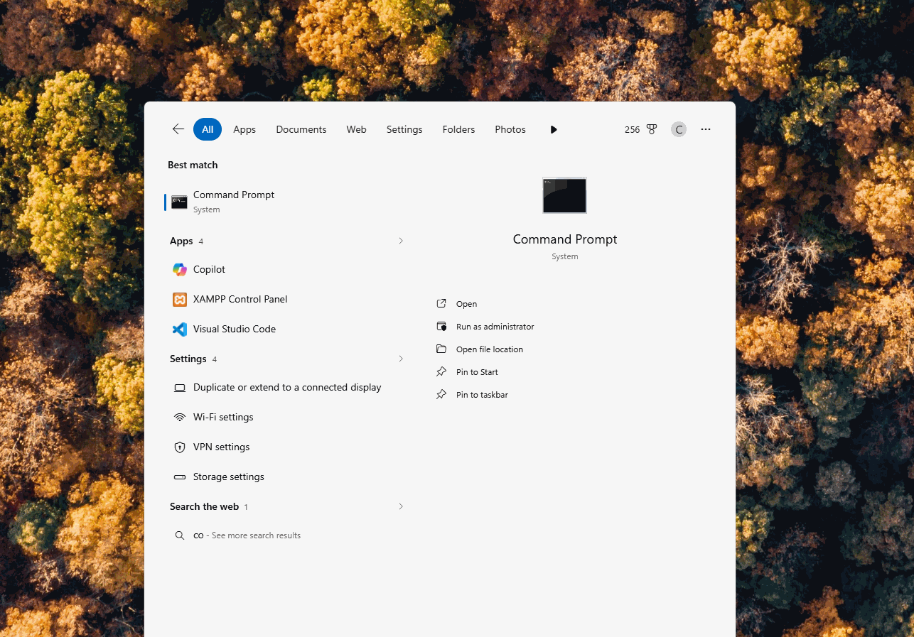

# AIDA — Flutter AI Chatbot

Build and explore **AIDA**, an Android chatbot that uses Flutter, Supabase,
Gemini, and Groq.

Choose **one scaffold** based on how you prefer to learn. Both scaffolds lead to
the same working Case 01 application.

## Choose your scaffold

| Scaffold | Best for | Starting point |
| --- | --- | --- |
| **Scaffold 1: Build-It Path** | Beginners who want to learn by creating AIDA one step at a time. | Start with the guided case study. |
| **Scaffold 2: Clone-and-Go Path** | Learners who want to download the completed code, configure it, and begin experimenting. | Start with `git clone`. |

---

## Scaffold 1 — Build-It Path

**Build it. Test it. Understand it.**

Choose this scaffold if you want a complete learn-by-doing journey. You will
start with installation, type the important code, connect each service, test the
application, and produce an APK.

### What you will do

1. Install Flutter and Android Studio.
2. Create a Flutter project.
3. Connect Supabase.
4. Configure Gemini and Groq.
5. Build the chatbot interface.
6. Generate and display AI responses.
7. Write basic tests.
8. Run AIDA on an emulator and Android phone.
9. Build the APK and prepare your evidence submission.

### Start here

**[Open the complete Build-It Path in Case-01.md](Case-01.md)**

Follow the steps in order. Each step includes an estimated completion time,
beginner explanations, reflection questions, completed-code references, and
evidence requirements.

---

## Scaffold 2 — Clone-and-Go Path

**Clone it. Configure it. Run it.**

Choose this scaffold if you want to begin with the completed AIDA codebase. You
can inspect how it works, switch AI providers, run tests, and add your own UI
improvements.

### 1. Clone the repository

```powershell
git clone https://github.com/cbatuic/aida.git
cd aida
```

### 2. Create your local environment file

On Windows PowerShell:

```powershell
Copy-Item .env.example .env
```

On macOS or Linux:

```bash
cp .env.example .env
```

Open `.env` and replace the placeholders with your own values:

```dotenv
AI_PROVIDER=gemini
SUPABASE_URL=https://your-project.supabase.co
SUPABASE_KEY=your_supabase_publishable_key
GEMINI_API_KEY=your_gemini_api_key
GROQ_API_KEY=your_groq_api_key
```

Set `AI_PROVIDER` to `gemini` or `groq`. Only the API key for the selected AI
provider is required.

### 3. Install packages

```powershell
flutter pub get
```

### 4. Run the quality checks

```powershell
flutter analyze
flutter test
```

### 5. Run AIDA

Start an Android emulator or connect an Android phone, then run:

```powershell
flutter run
```

### 6. Build the APK

```powershell
flutter build apk
```

The APK is created under `build/app/outputs/flutter-apk/`.

For the Supabase table setup, learning activities, UI challenge, reflection
questions, and evidence rubric, use the relevant sections of
**[Case-01.md](Case-01.md)**.

---

## Before you begin

Both scaffolds require:

- [Flutter SDK](https://docs.flutter.dev/install/manual)
- [Android Studio](https://developer.android.com/studio/install)
- A [Supabase](https://supabase.com/) project
- A [Gemini API key](https://ai.google.dev/gemini-api/docs/api-key) or
  [Groq API key](https://console.groq.com/docs/quickstart)

> **Security reminder:** `.env` is ignored by Git, but values bundled in a
> Flutter application can still be extracted from its APK. Use this setup for
> learning and local development; keep production AI keys on a secure backend.


## Minimum checklist before starting

Open a new terminal and run each command separately. The table explains why the
tool is needed and where to install or configure it if the command is not found.

### Command verification table

| Command | Use case | Environment is ready when | Official installation or setup guide |
| --- | --- | --- | --- |
| `flutter --version` | Display the installed Flutter SDK version used to build AIDA. | A Flutter version and stable channel are displayed. | [Install Flutter](https://docs.flutter.dev/install/manual) |
| `flutter doctor -v` | Inspect the complete Flutter and Android development environment. | Flutter and the Android toolchain have check marks with no blocking errors. | [Set up Flutter for Android](https://docs.flutter.dev/platform-integration/android/setup) |
| `dart --version` | Verify the Dart language SDK used to write AIDA's source code. | A Dart SDK version is displayed. | [Get the Dart SDK](https://dart.dev/get-dart) |
| `java --version` | Verify Java for Gradle and Android APK compilation. | A Java runtime version is displayed. | [Install Android Studio](https://developer.android.com/studio/install) |
| `adb version` | Detect, install, launch, and debug AIDA on an emulator or Android phone. | The Android Debug Bridge version and installation path are displayed. | [Install Android SDK Platform-Tools](https://developer.android.com/tools/releases/platform-tools) |
| `git --version` | Clone the AIDA repository and track code changes. | A Git version is displayed. | [Install Git](https://git-scm.com/downloads) |
| `code --version` | Open the project in Visual Studio Code from the terminal. | The Visual Studio Code version is displayed. | [Set up Visual Studio Code](https://code.visualstudio.com/docs/setup/setup-overview) |
| `emulator --version` | Create or launch the virtual Android device used to test AIDA. | The Android Emulator version is displayed. | [Install and configure the Android Emulator](https://developer.android.com/studio/run/emulator) |

If all commands complete successfully without errors, the development
environment is ready for the AIDA chatbot case study. If a command is not found,
follow its setup link, restart the terminal, and run the command again.

